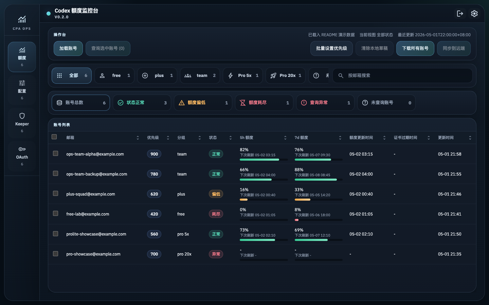
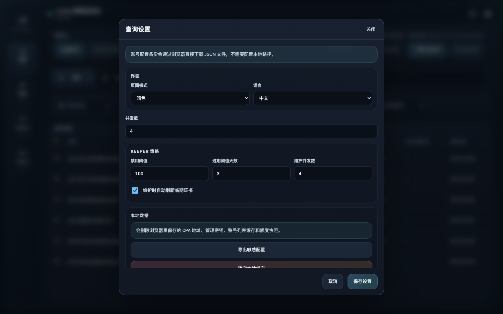
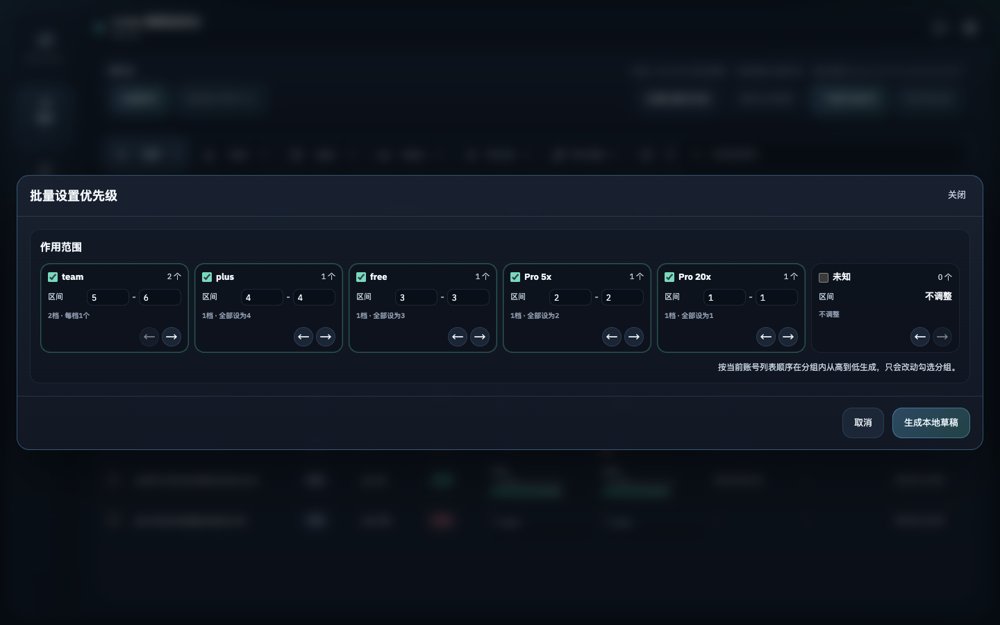

# CPA Codex Quota Mgt

面向 CPA Management API 的 Codex 账号额度管理工具。

仓库提供三种使用方式：

- Web 端
- 桌面端
- CLI

项目本身不包含 CPA 服务端，也不包含任何账号配置文件。使用前需要先部署可用的 CPA，并在 CPA 中导入 Codex 账号。

## 功能特性

- 统一查看账号分组、额度状态、最近查询时间和优先级。
- 支持批量查询、批量设置优先级、备份账号配置和同步本地草稿。
- 支持固定缓存目录与浏览器本地缓存清理。
- 同时提供 Web、桌面端和 CLI 三种使用方式。

下面的截图来自 README 演示模式，使用的都是虚构账号和虚构额度数据。

### 主界面总览



主界面把筛选、状态总览、账号列表和右侧详情面板放在同一页，适合做日常巡检和批量操作。

### 设置与缓存



设置面板集中管理并发数、本地缓存和浏览器端下载行为，方便清理环境或切换运行方式。

### 优先级设置



优先级支持批量分配和单账号微调两种方式，推荐先生成本地草稿，再决定是否同步到远端。

1. 点击工具栏里的 `批量设置优先级`，勾选要参与分配的分组，并按业务重要性调整左右顺序。越靠前的分组会拿到越高的优先级区间，未勾选分组保持当前远端值或已有本地草稿值。
2. 点击 `生成本地草稿` 后，新的优先级只会保存在本地，不会立刻改动 CPA 远端配置。这样可以先检查列表结果，再决定是否提交。
3. 如果只想改单个账号，可以在右侧详情面板直接输入优先级，点击 `应用到本地草稿`。若要撤销单个账号的修改，可点击 `恢复远端值`。
4. 确认草稿无误后再点击 `同步到远端`。如果想整批放弃本次改动，直接点击 `清除本地草稿`，界面会恢复为远端状态。

## 仓库结构

```text
.
├─ CHANGELOG.md
├─ codex_quota_checker.py
├─ test_codex_quota_checker.py
├─ requirements.txt
├─ README.md
└─ desktop/
   ├─ package.json
   ├─ package-lock.json
   ├─ requirements-portable-build.txt
   ├─ web-server.config.ts
   ├─ src/
   ├─ src-tauri/
   └─ scripts/
```

目录职责如下：

- `codex_quota_checker.py` 负责 CLI 查询和桌面端 Python sidecar worker。
- `desktop/src` 放 Web 与桌面端共用的 React / TypeScript 界面逻辑。
- `desktop/src-tauri` 放桌面端专属的 Rust / Tauri 壳层。
- `desktop/scripts` 放桌面端脚本，包括 Tauri CLI 转发和版本管理脚本。

## 使用前准备

PowerShell 建议先切到 UTF-8：

```powershell
chcp 65001 > $null; [Console]::InputEncoding = [System.Text.UTF8Encoding]::new(); [Console]::OutputEncoding = [System.Text.UTF8Encoding]::new(); $OutputEncoding = [System.Text.UTF8Encoding]::new()
```

克隆仓库：

```powershell
git clone https://github.com/MarkLunaCoder/CPA_Codex_Quota_Mgt.git
cd .\CPA_Codex_Quota_Mgt
```

## Web 端

Web 端只依赖 `desktop/` 里的前端工程。

Web 端边界：

- 只使用 `desktop/src` 里的 React 界面和浏览器请求逻辑。
- 不调用 Python worker。
- 不调用 Rust / Tauri 桌面壳层。

适用场景：

- 只想在浏览器里查看、查询和同步 CPA 数据。
- 不需要本地 exe。

环境要求：

- Node.js 20 或更新版本。

安装与开发：

```powershell
cd .\desktop
npm install
npm run web:dev
```

构建与预览：

```powershell
cd .\desktop
npm run web:build
npm run web:open
```

也可以单独预览构建产物：

```powershell
cd .\desktop
npm run web:preview
```

Web 端端口配置：

```text
desktop/web-server.config.ts
```

Web 端本地缓存：

- 使用 `localStorage` 的 `cpa_codex_quota_cache.*` 命名空间。
- 设置面板里的清空本地缓存按钮会删除这些浏览器缓存。
- 本地优先级草稿只存在当前页面内存里，清除本地草稿后会恢复为远端快照。

Web 端注意事项：

- 构建产物位于 `desktop/dist/`。
- 当前构建使用相对资源路径，`dist/index.html` 可以直接打开。
- 如果某些浏览器仍然限制 `file://` 下的脚本或请求，优先使用 `npm run web:open`。
- 浏览器直连异源 CPA 时，需要 CPA 或反向代理返回允许 CORS 的响应头。

### Docker Compose

仓库根目录提供了 `docker-compose.yml`，默认用于启动 Web 端开发服务：

```bash
docker compose up web
```

启动后打开：

```text
http://localhost:5173
```

如果要用接近构建产物的预览模式：

```bash
docker compose --profile preview up web-preview
```

预览模式端口为：

```text
http://localhost:9999
```

CLI 也可以通过 compose 按需运行，例如：

```bash
docker compose --profile cli run --rm cli query-all --cpa-base-url https://cpa.example/ --management-key <management-key> --json
```

Compose 只负责启动本项目的 Web/CLI 运行环境，不包含 CPA 服务端。Web 端仍然由浏览器直接请求 CPA，浏览器直连异源 CPA 时仍需要 CPA 或反向代理允许 CORS。

## 桌面端

桌面端由前端工程、Tauri 壳层和 Python sidecar 共同组成。

桌面端边界：

- 界面仍复用 `desktop/src`。
- 窗口管理、文件系统、系统浏览器打开外链等能力由 `desktop/src-tauri` 提供。
- 批量额度查询通过内置 Python sidecar 执行。

适用场景：

- 需要本地 exe。
- 需要固定缓存目录、桌面窗口和本地备份能力。

环境要求：

- Windows 10/11。
- Python 3.11 或更新版本。
- Node.js 20 或更新版本。
- Rust stable 工具链。
- Visual C++ Build Tools。

安装与开发：

```powershell
cd .\desktop
npm install
npm run tauri:install
npm run tauri:dev
```

portable 单 exe 构建：

```powershell
cd .\desktop
python -m pip install -r .\requirements-portable-build.txt
npm run portable:build
```

默认产物位于：

```text
desktop/build/portable/Codex Quota Desk.exe
```

桌面端本地缓存：

- 运行时统一写入固定目录 `cpa_codex_quota_cache/`。
- 开发态默认位于仓库根目录同级。
- release / portable 默认位于 exe 同级。

目录内包含：

- `runtime-config.json`
- `payload-cache.json`
- 内嵌 sidecar 的释放缓存

桌面端设置面板中的清空本地缓存会清掉以上内容。首页的 GitHub 仓库链接会交给系统默认浏览器打开，不会覆盖当前桌面窗口。

桌面端验证命令：

```powershell
cd .\desktop
npm test -- --run
npm run test:node
cargo test --manifest-path .\src-tauri\Cargo.toml
```

## CLI

CLI 只依赖根目录 Python 脚本，不依赖 React、Tauri 或桌面壳层。

CLI 边界：

- 入口是 `codex_quota_checker.py`。
- 运行期只使用 Python 标准库。
- 适合脚本化查询、批量巡检和调试 CPA 返回数据。

环境要求：

- Python 3.11 或更新版本。

Python 依赖：

- 根目录 `requirements.txt` 为空依赖说明文件。
- `codex_quota_checker.py` 运行期不需要第三方包。

常用命令：

查看账号列表：

```powershell
python .\codex_quota_checker.py list --cpa-base-url https://cpa.example/ --management-key <management-key>
```

查询单个账号：

```powershell
python .\codex_quota_checker.py query-one --auth-index <auth-index> --cpa-base-url https://cpa.example/ --management-key <management-key> --show-timings
```

查询多个账号：

```powershell
python .\codex_quota_checker.py query-many --auth-index <auth-index-1>,<auth-index-2> --cpa-base-url https://cpa.example/ --management-key <management-key> --max-workers 6 --show-timings
```

查询全部账号并输出 JSON：

```powershell
python .\codex_quota_checker.py query-all --cpa-base-url https://cpa.example/ --management-key <management-key> --json
```

进入交互模式：

```powershell
python .\codex_quota_checker.py
```

## 工作方式

额度查询固定通过 CPA Management API 发起，不在本地接管 Codex OAuth 刷新链，不会导致本地刷新额度引起远端CPA refresh token失效的问题。

使用到的核心接口：

```text
GET  /v0/management/auth-files
GET  /v0/management/auth-files/download
PATCH /v0/management/auth-files/fields
POST /v0/management/api-call
```

最终额度请求由 CPA 代发到：

```text
https://chatgpt.com/backend-api/wham/usage
```

## 版本管理

当前前端与桌面端统一以 `desktop/package.json` 作为主版本源。

## 致谢

- [CLIProxyAPI](https://github.com/router-for-me/CLIProxyAPI/)
- [Stitch](https://stitch.withgoogle.com/)
- [LINUX DO 社区](https://linux.do/)
- Codex
